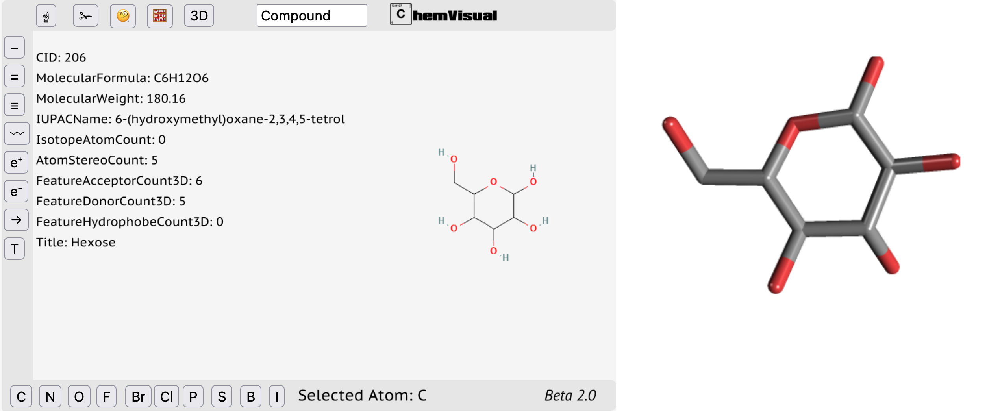

# ChemVisual ![Lang][lng-image] ![gym][gym-image]
## Programmeringproject
A Chemical Visualiser And Analysis Tool. This tool is made for chemical engineers. 

The 2.0 version will be featuring regioselectivity testing, deprotonation sites, logP calculator, singepoint energy analysis, electron density map and much more

## GUI

The model is based on the latest Javascript sockets and the InChl+Smiles chemical notation scheme. The code is made to run as an object oriented client-server program public to the internet. 

[lng-image]: https://img.shields.io/badge/LNG-Java_Script-orange
[gym-image]: https://img.shields.io/badge/Lecture-Programming_B-blue

